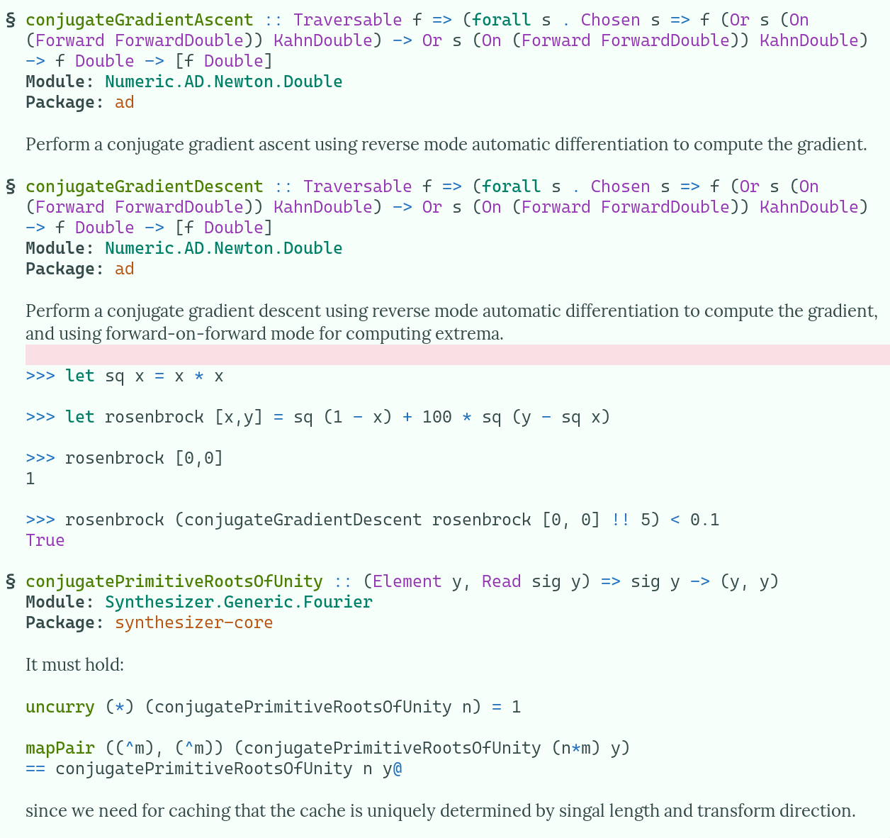

# consult-hoogle: A hoogle front end for Emacs. 

This package wraps the functionality of Haskell search engine. There are two modes for displaying hoogle results:
# Hoogle in a buffer
*hoogle-buffer* prompts for a query and displays the results in a buffer. The results and the code snippets inside documentation have syntax highlighting. It looks like this:

Use `M-x hoogle-buffer RET` to search the local *hoogle* database.
`M-x hoogle-buffer-project RET` searches the *hoogle* database specific to current project. By default it requires [cabal-hoogle](https://github.com/kokobd/cabal-hoogle).
`M-x hoogle-buffer-web RET` uses the json api provided by hoogle hosted at hoogle.haskell.org to fetch search results and shows them in a buffer.

# Hoogle in a minibuffer
*consult-hoogle* integrates *hoogle* with the Emacs completion system with the help of [consult](https://github.com/minad/consult).

Use `M-x consult-hoogle` to begin a hoogle search. The resulting interface looks like this:

If the current project has a local hoogle database, you can use `M-x consult-hoogle-project` to search it. By default this requires [cabal-hoogle](https://github.com/kokobd/cabal-hoogle).

*consult-hoogle* uses the preview functionality provided by to show the documentation of the selected candidate in a separate window. The documentation window can be turned off by calling `consult-hoogle` with a prefix arg. Where the documentation window appears can be configured by adding an entry to `display-buffer-alist` for `" *Hoogle Documentation*"`.

If you are using [vertico](https://github.com/minad/vertico) along with extensions, then using `vertico-buffer-mode`, the candidates and the documentation window can be arranged to appear side by side.

This will likely require configuring `display-buffer-alist` for `"*vertico-buffer*"` as well as `" *Hoogle Documentation*"`. Using `vertico-buffer-mode` only for this command can be done using `vertico-multiform-mode`.

# Interactive commands
## Restricting to specific package/module
`hoogle-base-restrict-to-module` (bound to `TAB m`) and `hoogle-base-restrict-to-package` (bound to `TAB p`) restrict the query to module and package of current candidate respectively. The restriction can be cleared by `hoogle-base-clear-restrictions` (bound to `TAB c`).

## Browsing the documentation
`hoogle-base-browse-item` (bound to `M-i`), `hoogle-base-browse-module` (bound to `M-m`), `hoogle-base-browse-package` (bound to `M-j`) use `browse-url` to open the documentation in a browser.

## Exporting to buffer
`consult-hoogle-export-to-buffer` provides a bridge between the *consult-hoogle* and *buffer-hoogle*. It uses the current minibuffer input and shows the corresponding search results in a buffer.
